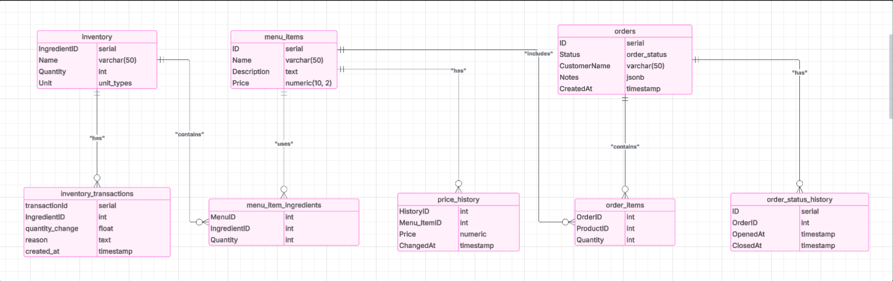

# Frappuccino ☕️

Frappuccino — это бэкенд-приложение для управления кофейней. Реализованы функции управления заказами, пользователями, меню и аналитикой. Сервис разработан с использованием языка Go, PostgreSQL и Docker.

## 🚀 Технологии

- Go — основной язык программирования
- PostgreSQL — СУБД
- Docker & docker-compose — контейнеризация
- REST API — архитектурный стиль
- JSONB, ENUM, TIMESTAMPTZ — специфичные типы данных в БД

## 📁 Структура проекта

frappuccino/
│
├── config/              # Конфигурации проекта
├── internal/
│   ├── handler/         # HTTP-обработчики
│   ├── models/          # Модели данных
│   ├── repository/      # Работа с базой данных
│   ├── service/         # Бизнес-логика
│   └── server/          # Инициализация и запуск сервера
│
├── pkg/                 # Переиспользуемые библиотеки
│   ├── database/        # Подключение к базе данных
│   ├── response/        # Централизированные ответы (DRY)
├── main.go              # Точка входа
├── init.sql             # Инициализация схемы БД
├── go.mod / go.sum      # Зависимости Go
├── .env                 # Переменные окружения
├── docker-compose.yml   # Docker-сервис
├── Dockerfile           # Docker-образ
├── ERD.png              # ER-диаграмма базы данных
└── README.md            # Документация

## ⚙️ Установка и запуск

### 1. Клонирование репозитория

bash
git clone https://github.com/aorazbai/frappuccino.git
cd frappuccino

### 2. Конфигурация .env

Создайте .env файл в корне проекта и укажите переменные окружения:

DB_HOST=localhost
DB_PORT=5432
DB_USER=postgresHTTP-обработчики
DB_PASSWORD=yourpassword
DB_NAME=frappuccino
SERVER_PORT=8080

### 3. Запуск с Docker

bash
docker-compose up --build
HTTP-обработчикиgreSQL работает, и выполните:

bash
go run main.go

## 📊 ERD (Entity Relationship Diagram)

## 🧪 API Endpoints

Примеры маршрутов (опционально добавить Swagger/OpenAPI):

- GET /menu — список напитков
- POST /orders — создать заказ
- GET /analytics/daily — аналитика по дням
- POST /auth/register — регистрация пользователя

## 📌 Использование типов данных

- JSONB — для хранения составов напитков
- ENUM — для фиксированных статусов заказа
- TIMESTAMPTZ — для точного хранения времени с часовым поясом

## 🧼 Тестирование

bash
go test ./...

